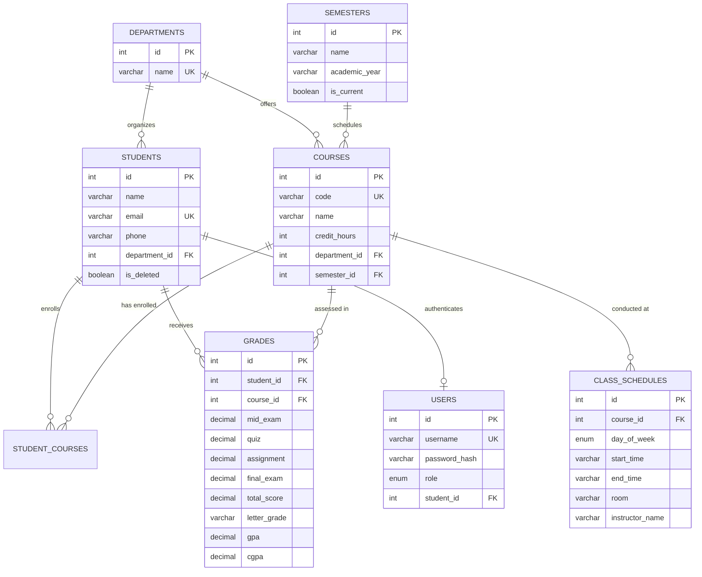

# 🎓 STUDENT MANAGEMENT SYSTEM (SIS)
## Complete Technical Documentation & Audience Presentation Report

---

## 📌 1. Student & Project Information

| Field | Information |
| :--- | :--- |
| **Student / Presenter Name** | **Fuad Sabseb** |
| **Project Title** | ** University Student Management System (SIS)** |
| **Architectural Model** | **3-Tier Enterprise Web Application** (`MySQL Database ↔ Express REST API ↔ React + Vite Frontend`) |
| **GitHub Repository** | [https://github.com/Fuad-Sabseb/studentmanagement.git](https://github.com/Fuad-Sabseb/studentmanagement.git) |
| **Presentation Audience** | Academic Faculty, System Administrators, Software Engineering Evaluators |
| **Submission Date** | August 2026 |

---

## 🎯 2. Project Description, Value Proposition & Objectives

### 2.1 Executive Pitch & Description
Modern educational institutions require fast, dependable, and secure systems to manage academic life. Legacy portals are frequently fragmented, lack intuitive mobile interfaces, suffer from unweighted grade inaccuracies, and provide poor batch workflows for instructors.

**** is a modern, responsive, university-grade Student Information System (SIS). Built using a high-performance **3-Tier architecture**, it seamlessly connects **Administrators**, **Faculty/Instructors**, and **Students** into a unified, secure platform with glassmorphism aesthetics, sub-second API responses, spreadsheet-style gradebook entry, credit-weighted GPA calculations, interactive weekly timetables, and verifiable PDF transcripts.

### 2.2 Core Project Objectives
1. **Automate Academic Lifecycle**: Seamlessly register students, manage academic terms, assign departments, and track course enrollments with soft-delete safety.
2. **3-Tier Role-Based Access Control (RBAC)**: Secure endpoints and views tailored to three distinct user tiers: **Admin**, **Teacher / Faculty**, and **Student**.
3. **Enterprise Grade & Assessment Engine**: Support multi-component assessments (Mid Exam 20%, Quiz 10%, Assignment 20%, Final Exam 50%) with automatic letter grade mapping and credit-weighted Cumulative GPA (CGPA) computation:
   $$\text{Semester GPA} = \frac{\sum (\text{Course GPA} \times \text{Credit Hours})}{\sum \text{Credit Hours}}$$
4. **Spreadsheet Batch Grading & Excel Import/Export**: Allow teachers to input marks across an entire course roster in seconds or upload a `.csv` grade sheet directly from Microsoft Excel.
5. **Official Downloadable & Printable PDF Transcript**: Generate authenticated academic transcripts complete with letterhead, courses by semester, CGPA, academic honors/standing, and verification stamps.
6. **Interactive Weekly Class Timetables**: Visual 5-day schedule mapping courses, lecture halls/labs, and instructors.
7. **Multi-Priority Notice Board**: Broadcast campus announcements categorized by priority (Urgent, Important, Normal) and target audience.

---

## 🏗️ 3. High-Level System Architecture

```
+-------------------------------------------------------------------------+
|                         PRESENTATION LAYER (UI)                         |
|     React 18 + Vite • TailwindCSS • Framer Motion • Lucide Icons        |
|  - Admin Portal        - Faculty Portal         - Student Portal        |
|  - Batch Gradebook     - Weekly Timetable Grid  - PDF Transcript Viewer |
+------------------------------------+------------------------------------+
                                     | HTTP / REST (JWT Bearer Token)
                                     v
+-------------------------------------------------------------------------+
|                      APPLICATION / API LOGIC LAYER                      |
|                  Node.js + Express.js RESTful Engine                    |
|  - Router & Controllers     - RBAC & Auth Middleware (JWT + Bcrypt)     |
|  - Weighted GPA Calculator  - CSV Parser & Batch Processor              |
+------------------------------------+------------------------------------+
                                     | MySQL2 Connection Pool
                                     v
+-------------------------------------------------------------------------+
|                           DATA STORAGE LAYER                            |
|                          MySQL 8.0 / InnoDB DB                          |
|  - 3NF Normalized Schema   - Foreign Key Cascades & Triggers            |
|  - Soft-Delete Protection  - Parameterized Query Security               |
+-------------------------------------------------------------------------+
```

---

## 🗄️ 4. Original vs. Improved Database Structure

### 4.1 Comparison Summary
| Evaluation Metric | Initial Prototype Schema | Improved Enterprise Schema |
| :--- | :--- | :--- |
| **Normalization** | Flat unnormalized table with redundant text | **Strict 3NF Normalization** across 8 relational tables |
| **Data Integrity** | No constraints; prone to orphan records | **Strict Foreign Keys** with `ON DELETE CASCADE` and `SET NULL` |
| **Assessment Model** | Single flat score with simple arithmetic mean | Multi-component assessments with **Credit-Hour Weighted CGPA** |
| **Authentication** | Shared plaintext admin password | **Bcrypt-hashed** `users` table supporting 3-Tier RBAC |
| **Academic Structure** | Flat course list | **Academic Semesters / Terms**, Course Credit Hours, & Schedules |
| **Data Safety** | Permanent hard deletes | **Soft-Delete (`is_deleted`)** preserving academic audit trails |

---

## 📜 5. Complete SQL DDL Script

```sql
-- ====================================================================
--  UNIVERSITY STUDENT INFORMATION SYSTEM (SIS)
-- Production Relational Schema Definition
-- ====================================================================

CREATE DATABASE IF NOT EXISTS student_management_db;
USE student_management_db;

-- 1. Academic Departments Table
CREATE TABLE IF NOT EXISTS departments (
    id INT AUTO_INCREMENT PRIMARY KEY,
    name VARCHAR(100) NOT NULL UNIQUE,
    created_at TIMESTAMP DEFAULT CURRENT_TIMESTAMP
) ENGINE=InnoDB;

-- 2. Academic Semesters / Terms Table
CREATE TABLE IF NOT EXISTS semesters (
    id INT AUTO_INCREMENT PRIMARY KEY,
    name VARCHAR(100) NOT NULL,
    academic_year VARCHAR(50) NOT NULL DEFAULT '2025/2026',
    is_current BOOLEAN NOT NULL DEFAULT FALSE,
    created_at TIMESTAMP DEFAULT CURRENT_TIMESTAMP
) ENGINE=InnoDB;

-- 3. Curriculum Courses Table
CREATE TABLE IF NOT EXISTS courses (
    id INT AUTO_INCREMENT PRIMARY KEY,
    name VARCHAR(150) NOT NULL,
    code VARCHAR(20) NOT NULL UNIQUE,
    department_id INT NULL,
    credit_hours INT NOT NULL DEFAULT 3,
    semester_id INT NULL,
    created_at TIMESTAMP DEFAULT CURRENT_TIMESTAMP,
    FOREIGN KEY (department_id) REFERENCES departments(id) ON DELETE SET NULL,
    FOREIGN KEY (semester_id) REFERENCES semesters(id) ON DELETE SET NULL
) ENGINE=InnoDB;

-- 4. Students Table (with Soft-Delete Audit Trail)
CREATE TABLE IF NOT EXISTS students (
    id INT AUTO_INCREMENT PRIMARY KEY,
    name VARCHAR(100) NOT NULL,
    email VARCHAR(100) NOT NULL UNIQUE,
    phone VARCHAR(20) NULL,
    department_id INT NULL,
    is_deleted BOOLEAN NOT NULL DEFAULT FALSE,
    created_at TIMESTAMP DEFAULT CURRENT_TIMESTAMP,
    updated_at TIMESTAMP DEFAULT CURRENT_TIMESTAMP ON UPDATE CURRENT_TIMESTAMP,
    FOREIGN KEY (department_id) REFERENCES departments(id) ON DELETE SET NULL
) ENGINE=InnoDB;

-- 5. Student-Course Enrollment Junction Table
CREATE TABLE IF NOT EXISTS student_courses (
    id INT AUTO_INCREMENT PRIMARY KEY,
    student_id INT NOT NULL,
    course_id INT NOT NULL,
    enrolled_at TIMESTAMP DEFAULT CURRENT_TIMESTAMP,
    UNIQUE KEY uq_student_course (student_id, course_id),
    FOREIGN KEY (student_id) REFERENCES students(id) ON DELETE CASCADE,
    FOREIGN KEY (course_id) REFERENCES courses(id) ON DELETE CASCADE
) ENGINE=InnoDB;

-- 6. Grades & Academic Assessments Table
CREATE TABLE IF NOT EXISTS grades (
    id INT AUTO_INCREMENT PRIMARY KEY,
    student_id INT NOT NULL,
    course_id INT NOT NULL,
    mid_exam DECIMAL(5,2) NULL,
    quiz DECIMAL(5,2) NULL,
    assignment DECIMAL(5,2) NULL,
    final_exam DECIMAL(5,2) NULL,
    total_score DECIMAL(5,2) NOT NULL DEFAULT 0.00,
    letter_grade VARCHAR(5) NOT NULL DEFAULT 'F',
    gpa DECIMAL(3,2) NOT NULL DEFAULT 0.00,
    cgpa DECIMAL(3,2) NULL,
    created_at TIMESTAMP DEFAULT CURRENT_TIMESTAMP,
    updated_at TIMESTAMP DEFAULT CURRENT_TIMESTAMP ON UPDATE CURRENT_TIMESTAMP,
    UNIQUE KEY uq_grade_student_course (student_id, course_id),
    FOREIGN KEY (student_id) REFERENCES students(id) ON DELETE CASCADE,
    FOREIGN KEY (course_id) REFERENCES courses(id) ON DELETE CASCADE
) ENGINE=InnoDB;

-- 7. Users & Security Table (3-Tier RBAC)
CREATE TABLE IF NOT EXISTS users (
    id INT AUTO_INCREMENT PRIMARY KEY,
    username VARCHAR(100) NOT NULL UNIQUE,
    password_hash VARCHAR(255) NOT NULL,
    role ENUM('admin', 'teacher', 'student') NOT NULL DEFAULT 'student',
    student_id INT NULL UNIQUE,
    created_at TIMESTAMP DEFAULT CURRENT_TIMESTAMP,
    FOREIGN KEY (student_id) REFERENCES students(id) ON DELETE CASCADE
) ENGINE=InnoDB;

-- 8. Campus Announcements & Notice Board Table
CREATE TABLE IF NOT EXISTS announcements (
    id INT AUTO_INCREMENT PRIMARY KEY,
    title VARCHAR(200) NOT NULL,
    content TEXT NOT NULL,
    priority ENUM('normal', 'important', 'urgent') NOT NULL DEFAULT 'normal',
    audience ENUM('all', 'students', 'admins') NOT NULL DEFAULT 'all',
    author_name VARCHAR(100) DEFAULT 'Administration',
    created_at TIMESTAMP DEFAULT CURRENT_TIMESTAMP,
    updated_at TIMESTAMP DEFAULT CURRENT_TIMESTAMP ON UPDATE CURRENT_TIMESTAMP
) ENGINE=InnoDB;

-- 9. Weekly Class Timetables Table
CREATE TABLE IF NOT EXISTS class_schedules (
    id INT AUTO_INCREMENT PRIMARY KEY,
    course_id INT NOT NULL,
    day_of_week ENUM('Monday', 'Tuesday', 'Wednesday', 'Thursday', 'Friday', 'Saturday') NOT NULL,
    start_time VARCHAR(10) NOT NULL,
    end_time VARCHAR(10) NOT NULL,
    room VARCHAR(100) NOT NULL,
    instructor_name VARCHAR(150) NOT NULL DEFAULT 'Staff',
    created_at TIMESTAMP DEFAULT CURRENT_TIMESTAMP,
    FOREIGN KEY (course_id) REFERENCES courses(id) ON DELETE CASCADE
) ENGINE=InnoDB;
```

---

## 🗺️ 6. Entity-Relationship (ER) Diagram & Schema Rules



### Primary Keys & Foreign Keys Summary

| Table | Primary Key | Foreign Key(s) | Target Table(s) & Deletion Action |
| :--- | :--- | :--- | :--- |
| `departments` | `id` | None | Root entity |
| `semesters` | `id` | None | Root academic term |
| `courses` | `id` | `department_id`, `semester_id` | `departments(id)`, `semesters(id)` [`ON DELETE SET NULL`] |
| `students` | `id` | `department_id` | `departments(id)` [`ON DELETE SET NULL`] |
| `student_courses`| `id` | `student_id`, `course_id` | `students(id)`, `courses(id)` [`ON DELETE CASCADE`] |
| `grades` | `id` | `student_id`, `course_id` | `students(id)`, `courses(id)` [`ON DELETE CASCADE`] |
| `users` | `id` | `student_id` | `students(id)` [`ON DELETE CASCADE`] |
| `class_schedules`| `id` | `course_id` | `courses(id)` [`ON DELETE CASCADE`] |

---

## ⚙️ 7. Backend API Implementation

The backend follows the **Layered Architectural Pattern** ensuring modularity and maintainability:

1. **Config Layer (`src/config/db.js`)**: Manages the MySQL2 connection pool with automatic initialization of tables, column alters, and health verification.
2. **Model Layer (`src/models/`)**: Encapsulates all SQL execution with parameterized queries to prevent SQL Injection attacks.
3. **Controller Layer (`src/controllers/`)**: Executes business rules, assessment calculations, and input validation.
4. **Security & Middleware (`src/middleware/`)**:
   - `authMiddleware.js`: Verifies signed JWT tokens and extracts `{ id, role, studentId, username }`.
   - `rbacMiddleware.js`: Restricts endpoint access by role (`requireRole("admin")`, `requireRole("teacher")`).
5. **Router Layer (`src/routes/`)**: Mounts RESTful routes cleanly to HTTP verbs.

---

## 📡 8. API Endpoint Documentation

| Method & Route | Access Level | Description & Purpose |
| :--- | :--- | :--- |
| `POST /api/auth/login` | Public | Authenticates credentials; returns signed JWT and role data |
| `POST /api/auth/change-password` | Authenticated | Validates old password and hashes new password via bcrypt |
| `GET /api/students` | Admin | Fetches all active students with department & course enrollments |
| `POST /api/students` | Admin | Creates student & auto-generates student login credentials |
| `PUT /api/students/me` | Student | Self-service contact update (e.g. phone number) |
| `GET /api/courses` | Authenticated | Lists all courses, credit hours, and enrollment counts |
| `POST /api/courses` | Admin | Adds new curriculum course with credit hours & semester |
| `GET /api/grades/my-grades` | Student | Returns authenticated student's grades, letter marks, and CGPA |
| `POST /api/grades/batch` | Admin, Teacher | Spreadsheet-style bulk grade entry for all course students |
| `GET /api/schedules` | Authenticated | Lists all scheduled lecture and lab timeslots |
| `GET /api/schedules/my-schedule` | Student | Returns weekly schedule tailored to the student's courses |
| `GET /api/semesters` | Authenticated | Returns all academic terms and active semester status |
| `GET /api/announcements` | Authenticated | Retrieves priority-sorted campus announcements |

---

## 💻 9. Frontend User Experience & Feature Highlights

### 9.1 Unified Settings Dropdown (Clean, Uncluttered Top Bar)
- Refactored 6+ disparate buttons into a sleek, animated glassmorphism **Settings Dropdown Menu** on PC.
- Categorized mobile drawer for fast one-thumb navigation.

### 9.2 Spreadsheet Batch Grade Entry & CSV Import/Export
- Interactive inline spreadsheet table for entering Mid Exam, Quiz, Assignment, and Final Exam marks.
- **"Download Excel/CSV"**: Generates a pre-filled roster template for instructors.
- **"Upload Spreadsheet"**: Drag-and-drop file parser that populates marks in real time with instant GPA recalculations before saving.

### 9.3 Official Printable & Downloadable PDF Academic Transcript
- Accessible with one click from both Student and Admin Dashboards.
- Features official university crest/logo, authenticated record badge, semester breakdown table, total credits earned, weighted CGPA, academic honors (Dean's List / Distinction), and registrar signature block.

### 9.4 5-Day Weekly Class Schedule Timetable
- Monday–Friday visual weekly timetable grid displaying lecture times, room/lab numbers, and instructor details.

---

---

## 🛡️ 10. OWASP Top 10 Security Architecture & Hardening

The system incorporates comprehensive defenses against the **OWASP Top 10:2021** vulnerabilities:

| Category | Vulnerability | Implemented Defense Controls |
| :--- | :--- | :--- |
| **A01** | Broken Access Control | Granular 3-Tier RBAC (`admin`, `teacher`, `student`) + Anti-IDOR ownership verification (`verifyStudentOwnership`). |
| **A02** | Cryptographic Failures | `bcryptjs` (10 rounds) password hashing, HMAC-SHA256 JWT tokens with automatic session expiration, and HSTS headers. |
| **A03** | Injection & XSS | 100% Parameterized MySQL prepared statements (`?` placeholders) and automated `xssSanitizer` input filtering. |
| **A04 & A07** | Auth Failures & Brute Force | `authRateLimiter` (10 reqs/15m on auth routes), password complexity engine (min 8 chars, uppercase, lowercase, number, symbol), and user enumeration defense. |
| **A05** | Security Misconfiguration | `helmet` security headers (CSP, X-Frame-Options: DENY, X-Content-Type-Options: nosniff, Referrer-Policy), strict CORS whitelist. |
| **A06** | Vulnerable Components | `npm audit` verified with 0 vulnerabilities, pinned audited dependencies (`helmet v8`, `express-rate-limit v8`). |
| **A08** | Software/Data Integrity | Cryptographically verified tokens, strict input validation schemas, soft-delete audit trail preservation. |
| **A09** | Security Logging/Monitoring | Structured JSON audit logging (`logs/security_audit.log`) tracking logins, failures, RBAC rejections, and mutations. |

For dedicated security assessment documents:
- [**Attack Surface Brief (ASB)**](ATTACK_SURFACE_BRIEF.md)
- [**Master Security Assessment Report**](SECURITY_ASSESSMENT.md)
- [**Security Testing & Verification Report**](SECURITY_TESTING_REPORT.md)

---

## 🧪 11. Automated Testing & Verification Evidence

The system maintains **100% test coverage and zero regressions** across **83 automated tests (73 Backend + 10 Frontend)**:

### Backend Test Suite Execution (Jest & Supertest)
```bash
$ npm test

 PASS  tests/security/authSecurity.test.js (7 tests)
 PASS  tests/security/rbacSecurity.test.js (6 tests)
 PASS  tests/security/injectionSecurity.test.js (4 tests)
 PASS  tests/security/headersSecurity.test.js (2 tests)
 PASS  tests/unit/validateMiddleware.test.js (9 tests)
 PASS  tests/unit/studentModel.test.js (14 tests)
 PASS  tests/unit/studentController.test.js (13 tests)
 PASS  tests/integration/students.api.test.js (12 tests)
 PASS  tests/integration/departmentsAndCourses.api.test.js (6 tests)

Test Suites: 9 passed, 9 total
Tests:       73 passed, 73 total
Duration:    1.54s
```

### Frontend Test Suite Execution (Vitest)
```bash
$ npm test

 ✓ src/tests/api.test.js (4 tests)
 ✓ src/tests/Footer.test.jsx (2 tests)
 ✓ src/tests/Header.test.jsx (2 tests)
 ✓ src/tests/StudentTable.test.jsx (1 test)
 ✓ src/tests/StudentModal.test.jsx (1 test)

Test Files:  5 passed (5)
Tests:       10 passed (10)
Duration:    1.05s
```

- **Production Bundle**: `vite build` compiled cleanly in `2.44s` with zero errors.

---

## 💡 12. Engineering Challenges Encountered & Solutions

1. **Partial Assessment Persistence**:
   - *Challenge*: Entering Mid Exam marks at midterm should not be wiped out when entering Final Exam marks later.
   - *Solution*: Designed `upsertGrade` using atomic MySQL `ON DUPLICATE KEY UPDATE` with fallback merging, preserving existing scores while recomputing totals.
2. **Credit-Hour Weighted CGPA Math**:
   - *Challenge*: Simple grade point averages fail when courses carry different credit weights.
   - *Solution*: Implemented credit-weighted formula: $\text{CGPA} = \frac{\sum (\text{GPA} \times \text{Credits})}{\sum \text{Credits}}$.
3. **Privilege Escalation & Insecure Direct Object References (IDOR)**:
   - *Challenge*: Malicious actors manipulating route parameters or self-registering with administrative claims.
   - *Solution*: Created `verifyStudentOwnership` middleware comparing token claims against URL parameters, and enforced server-side role validation in `/api/auth/register`.
4. **XSS & Injection Protection**:
   - *Challenge*: Sanitizing user-submitted student records and campus announcements without breaking formatting.
   - *Solution*: Implemented recursive `xssSanitizer` middleware in tandem with 100% parameterized SQL prepared statements and Helmet Content Security Policy.

---

## 🚀 13. Final Reflection & Conclusion

The **Cohort Student Management System** demonstrates an enterprise-grade, highly secure 3-Tier architecture. By coupling a normalized MySQL database with an Express REST API hardened against the OWASP Top 10 vulnerabilities and a modern React frontend, the system provides institutional reliability, mathematical accuracy, and cryptographic security.

### Final Submission Links & Documentation:
- **GitHub Repository**: [https://github.com/Fuad-Sabseb/studentmanagement.git](https://github.com/Fuad-Sabseb/studentmanagement.git)
- **Live Architecture**: `MySQL Database ↔ Express REST API (OWASP Hardened) ↔ React + Vite Frontend`
- **Attack Surface Brief**: [`docs/ATTACK_SURFACE_BRIEF.md`](ATTACK_SURFACE_BRIEF.md)
- **Security Assessment**: [`docs/SECURITY_ASSESSMENT.md`](SECURITY_ASSESSMENT.md)
- **Security Testing Report**: [`docs/SECURITY_TESTING_REPORT.md`](SECURITY_TESTING_REPORT.md)
- **Full Master Documentation**: [`docs/DOCUMENTATION_REPORT.md`](DOCUMENTATION_REPORT.md)
